# Relay v1.0 — Database Schema

MySQL 8 · InnoDB · `utf8mb4_unicode_ci`

---

## ER Diagram

```mermaid
erDiagram
    organizations ||--o{ workspaces : "has many"
    organizations ||--o{ organization_members : "has many"
    users ||--o{ organization_members : "belongs to"
    workspaces ||--o{ workspace_members : "has many"
    users ||--o{ workspace_members : "belongs to"
    workspaces ||--o{ teams : "has many"
    teams ||--o{ team_members : "has many"
    users ||--o{ team_members : "on team"
    organizations ||--o{ invitations : "sends"
    workspaces ||--o{ invitations : "targets"
    users ||--o{ invitations : "invited_by"
    users ||--o{ password_reset_tokens : "has"
    users ||--o{ refresh_tokens : "has"
    users ||--o{ user_workspace_preferences : "has"

    workspaces ||--o{ channels : "has many"
    users ||--o{ channels : "created_by"
    channels ||--o{ channel_members : "has many"
    users ||--o{ channel_members : "member of"
    channels ||--o{ messages : "contains"
    users ||--o{ messages : "authored"
    messages ||--o{ messages : "thread replies"
    messages ||--o{ message_reactions : "has"
    messages ||--o{ message_mentions : "has"
    channels ||--o{ pinned_messages : "pins"

    workspaces ||--o{ projects : "has many"
    projects ||--o{ tasks : "contains"
    users ||--o{ tasks : "assigned / reported"
    tasks ||--o{ task_comments : "has"
    tasks ||--o{ task_activity : "logged"

    workspaces ||--o{ pages : "has many"
    pages ||--o{ pages : "nested under"
    pages ||--o{ page_blocks : "composed of"
    pages ||--o{ page_permissions : "granted on"
    pages ||--o{ page_comments : "has"
    teams ||--o{ page_permissions : "granted to"

    workspaces ||--o{ files : "stores"
    workspaces ||--o{ entity_links : "scopes"
    workspaces ||--o{ notifications : "scopes"
    workspaces ||--o{ audit_events : "scopes"
    workspaces ||--o{ search_documents : "indexes"
    users ||--o{ notifications : "receives"
```

---

## Relationship Reference

### 1. Identity & Tenancy

| Relationship | Cardinality | Explanation |
|--------------|-------------|-------------|
| **Organization → Workspace** | 1:N | An organization is the top-level tenant. Workspaces partition collaboration (e.g. "Engineering", "Company"). Deleting an org cascades to its workspaces and all workspace-scoped data. |
| **Organization → OrganizationMember** | 1:N | Links users to orgs with an org-level role (`OWNER`, `ADMIN`, `MEMBER`). A user can belong to one org in MVP UI but schema allows one row per org-user pair. |
| **User → OrganizationMember** | 1:N | A user may belong to multiple organizations (future-proof). Unique on `(organization_id, user_id)`. |
| **Workspace → WorkspaceMember** | 1:N | Grants workspace access with role `ADMIN` or `MEMBER`. Distinct from org role — controls day-to-day collaboration inside a workspace. |
| **User → WorkspaceMember** | 1:N | A user joins workspaces via membership rows. Unique on `(workspace_id, user_id)`. |
| **User → PasswordResetToken** | 1:N | Short-lived tokens for password recovery. Cascade delete when user is removed. |
| **User → RefreshToken** | 1:N | Long-lived refresh tokens for JWT rotation. Revoked via `revoked_at`; cascade delete on user removal. |
| **User → UserWorkspacePreferences** | 1:1 per workspace | Stores per-user dashboard pins and UI prefs as JSON. Composite PK `(user_id, workspace_id)`. |

### 2. Directory (Teams & Invitations)

| Relationship | Cardinality | Explanation |
|--------------|-------------|-------------|
| **Workspace → Team** | 1:N | Lightweight groups inside a workspace (e.g. "Frontend"). Used for page permissions and future @team mentions. |
| **Team → TeamMember** | N:M | Junction table linking users to teams. Composite PK `(team_id, user_id)`. |
| **Organization → Invitation** | 1:N | Pending email invites to join the org and optionally a specific workspace. |
| **Workspace → Invitation** | 1:N (optional) | When set, accepting the invite auto-joins that workspace with `workspace_role`. Nullable for org-only invites. |
| **User → Invitation (invited_by)** | 1:N | Audit trail of who sent the invite. `ON DELETE SET NULL` if inviter is removed. |

### 3. Messaging

| Relationship | Cardinality | Explanation |
|--------------|-------------|-------------|
| **Workspace → Channel** | 1:N | Channels belong to one workspace. Types: `PUBLIC`, `PRIVATE`, `DM`. Name unique per workspace. |
| **User → Channel (created_by)** | 1:N | Creator reference for audit. `ON DELETE SET NULL`. |
| **Channel → ChannelMember** | N:M | Required for `PRIVATE` and `DM` channels; optional tracking for public channels (join time, `last_read_at` for unread badges). |
| **Channel → Message** | 1:N | Messages are append-only content in a channel. Indexed by `(channel_id, created_at)` for pagination. |
| **User → Message (author)** | 1:N | Every message has an author. `ON DELETE RESTRICT` — don't hard-delete users with messages (soft-delete users instead). |
| **Message → Message (parent)** | 1:N | `parent_message_id` points to the direct parent for thread replies. |
| **Message → Message (thread_root)** | 1:N | `thread_root_id` denormalizes the thread root for efficient thread queries. |
| **Message → MessageReaction** | N:M | Emoji reactions per user per message. Composite PK `(message_id, user_id, emoji)`. |
| **Message → MessageMention** | 1:N | @user, @here, or @channel mentions. Optional FKs to `users` and `channels`. |
| **Channel → PinnedMessage** | N:M | Junction for pinned messages with `pinned_by_user_id` and `pinned_at`. |

### 4. Work Management

| Relationship | Cardinality | Explanation |
|--------------|-------------|-------------|
| **Workspace → Project** | 1:N | Groups tasks by initiative. `ACTIVE` or `ARCHIVED`. |
| **Project → Task** | 1:N | Tasks optionally belong to a project (`project_id` nullable for inbox tasks). |
| **Workspace → Task** | 1:N | Every task is workspace-scoped for tenancy isolation even without a project. |
| **User → Task (assignee)** | 1:N | Optional assignee. `ON DELETE SET NULL`. |
| **User → Task (reporter)** | 1:N | User who created the task. `ON DELETE RESTRICT`. |
| **Task → TaskComment** | 1:N | Discussion on a task. |
| **Task → TaskActivity** | 1:N | Immutable audit of field changes (status, assignee, etc.) stored as JSON metadata. |

### 5. Knowledge (Docs)

| Relationship | Cardinality | Explanation |
|--------------|-------------|-------------|
| **Workspace → Page** | 1:N | Root and nested pages form a tree via `parent_page_id` self-reference. |
| **Page → Page (parent)** | 1:N | Self-referential hierarchy. `ON DELETE SET NULL` moves orphans to root. |
| **Page → PageBlock** | 1:N | Ordered block content (`position` column). `content` stored as JSON. |
| **Page → PagePermission** | 1:N | Fine-grained access. Each row grants `OWNER`, `EDITOR`, or `VIEWER` to a **user** or **team** (never both). |
| **Page → PageComment** | 1:N | Comments on a page; optional `block_id` for block-level comments. |

### 6. Cross-Cutting Platform

| Relationship | Cardinality | Explanation |
|--------------|-------------|-------------|
| **Workspace → File** | 1:N | Uploaded file metadata; binary in object storage (`storage_key`). |
| **File → FileAttachment** | 1:N | Polymorphic join to `MESSAGE`, `TASK_COMMENT`, or `PAGE` via `(attachable_type, attachable_id)`. |
| **Workspace → EntityLink** | 1:N | Polymorphic links between messages, tasks, and pages. Unique on full source+target pair per workspace. |
| **User → Notification** | 1:N | In-app notifications scoped to workspace. Indexed for unread queries. |
| **Workspace → AuditEvent** | 1:N | Append-only admin/security log. Actor nullable for system events. |
| **Workspace → SearchDocument** | 1:N | Denormalized search index. FULLTEXT on `(title, body)`. One row per indexed entity. |

---

## Migration Files

| Version | File | Contents |
|---------|------|----------|
| V1 | `V1__baseline.sql` | Scaffold placeholder (existing) |
| V2 | `V2__identity_and_tenant.sql` | `organizations`, `workspaces`, `users`, tokens |
| V3 | `V3__directory.sql` | Memberships, teams, invitations, preferences |
| V4 | `V4__messaging.sql` | Channels, messages, reactions, mentions, pins |
| V5 | `V5__work.sql` | Projects, tasks, comments, activity |
| V6 | `V6__knowledge.sql` | Pages, blocks, permissions, comments |
| V7 | `V7__platform.sql` | Files, links, notifications, audit, search |

---

## Conventions

- **PKs:** `BIGINT UNSIGNED AUTO_INCREMENT`
- **Public IDs:** `CHAR(36)` UUID strings for API exposure
- **Timestamps:** `DATETIME(6)` UTC
- **Soft delete:** `deleted_at` on user-generated content tables
- **Tenancy:** `workspace_id` on all workspace-scoped tables; `organization_id` on org-scoped tables
- **Engine:** InnoDB with `utf8mb4_unicode_ci`
